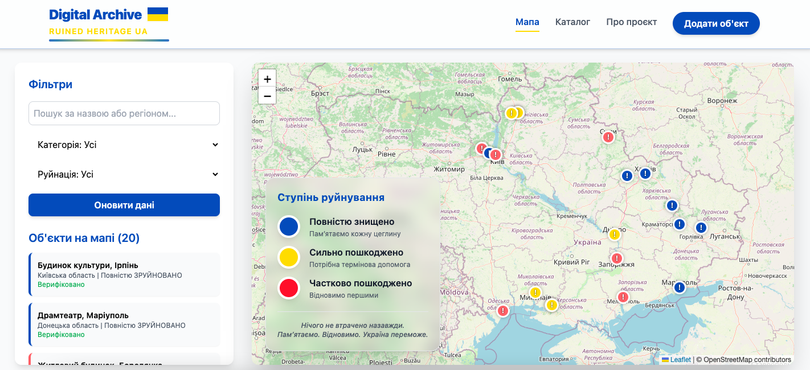

# ЗРУЙНОВАНА СПАДЩИНА  
**Цифровий архів культурної спадщини України, пошкодженої війною**



> **Пам’ятаємо кожну церкву. Кожну бібліотеку. Кожну пам’ятку.**  
> Нічого не втрачено назавжди — поки ми пам’ятаємо.

**[Переглянути живу версію](https://digital-archive-ruined-heritage-ua.vercel.app/)**

---

### Дипломна робота магістра  
**Тема:**  
«Розробка цифрового архіву “Зруйнована спадщина України”: інтерактивна мапа втрат культурно-історичних пам’яток внаслідок російської агресії»

**Автор:** Лифенко Дмитро Миколайович  
**Ступінь:** Master of Science in Computer Science  
**Університет:** WOOLF NEOVERSITY 
**Рік захисту:** 2025

---

### Мета проєкту
Створити **єдину верифіковану платформу** для:
- Меморіалізації знищених та пошкоджених пам’яток
- Інформування міжнародної спільноти (UNESCO, EU)
- Формування цифрової основи для майбутнього відновлення
- Підтримки AR/VR-туризму та віртуальних реконструкцій

---

### Технологічний стек (Full-Stack MVP)

| Шар              | Технологія                          | Призначення                              |
|------------------|-------------------------------------|-------------------------------------------|
| Фронтенд         | React + Vite + Tailwind CSS         | Швидкий, сучасний, адаптивний інтерфейс   |
| Картографія      | Leaflet + React-Leaflet + OpenStreetMap | Інтерактивна мапа з кластеризацією        |
| Бекенд / БД      | Supabase (PostgreSQL + PostGIS)     | Геопросторові запити, автентифікація      |
| Зберігання медіа | Supabase Storage                    | Фото «до» і «після» руйнувань             |
| Хостинг          | Vercel / Netlify                    | Безкоштовний деплой з CI/CD               |

---

### Основні функції

- Інтерактивна мапа з верифікованими об’єктами
- Фільтри за регіоном, категорією, ступенем пошкодження
- Детальні картки об’єктів (фото до/після, опис, джерела)
- Форма додавання нових об’єктів (з модерацією)
- Адаптивний дизайн (мобільні + десктоп)

---

### Як запустити локально

```bash
# 1. Клонувати репозиторій
git clone https://github.com/Lyfenko/digital-archive-ruined-heritage-ua.git
cd digital-archive-ruined-heritage-ua

# 2. Встановити залежності
npm install

# 3. Створити .env (приклад в .env.example)
cp .env.example .env
# → вставити свої SUPABASE_URL та SUPABASE_ANON_KEY

# 4. Запустити
npm run dev